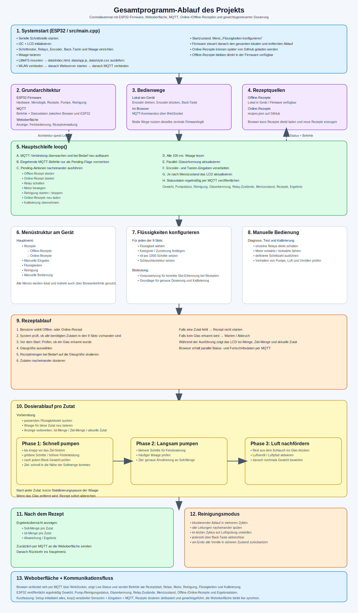

# Gesamtprogramm-Ablauf

Dieses Dokument beschreibt den technischen Gesamtablauf des Cocktailautomaten aus Firmware, Weboberfläche und Kommunikation.

---

## 1. Systemstart

Beim Einschalten startet der ESP32 die serielle Schnittstelle und initialisiert danach nacheinander alle benötigten Hardware-Komponenten:

- I2C-Bus und LCD
- Schrittmotor-Treiber
- Relais für Flüssigkeiten und Luft
- Rotary-Encoder und Back-Taste
- HX711-Waage
- LittleFS für die Webdateien

Anschließend versucht das System, sich mit dem WLAN zu verbinden. Wenn die WLAN-Verbindung erfolgreich ist, startet der Webserver und danach die MQTT-Verbindung. Nach Abschluss der Initialisierung wechselt das Gerät in das Menü **„Flüssigkeiten konfigurieren“**.

---

## 2. Grundarchitektur

Das Gesamtsystem besteht aus drei Hauptteilen:

1. **ESP32-Firmware**  
   Steuert Hardware, Menüführung, Rezepte, Dosierung, Reinigung und Statuslogik.

2. **Weboberfläche**  
   Läuft im Browser, zeigt Live-Daten an und sendet Bedienbefehle.

3. **MQTT-Kommunikation**  
   Verbindet Browser und ESP32. Statusmeldungen werden veröffentlicht, Befehle werden an den ESP32 gesendet.

Zusätzlich können **Online-Rezepte** aus `recipes.json` von GitHub geladen werden. **Offline-Rezepte** sind direkt in der Firmware verfügbar.

---

## 3. Hauptschleife der Firmware

Die `loop()`-Funktion übernimmt den laufenden Gesamtbetrieb.

### 3.1 Kommunikationsüberwachung

- MQTT wird zyklisch überwacht.
- Bei Verbindungsverlust wird automatisch ein Reconnect versucht.
- Eingehende MQTT-Nachrichten werden im Callback nur analysiert.
- Aufwändige oder blockierende Aktionen werden nicht direkt dort ausgeführt, sondern zuerst über **Pending-Flags** vorgemerkt.

### 3.2 Abarbeitung der Pending-Flags

In der Hauptschleife werden dann nacheinander unter anderem folgende Aktionen ausgeführt:

- Offline-Rezept starten
- Online-Rezept starten
- Relay schalten
- Motor bewegen
- Reinigung starten oder stoppen
- Online-Rezepte neu laden
- Fluid-Kalibrierung speichern
- Waagen-Kalibrierung übernehmen

### 3.3 Sensorik und Bedienung

- Die Waage wird regelmäßig gelesen.
- Parallel läuft die Glaserkennung.
- Danach werden Encoder und Tasten ausgewertet.
- Je nach aktuellem Menü wird anschließend das LCD aktualisiert.

Während ein Rezept läuft, wird die Anzeige laufend mit Fortschritt und Ist-Menge aktualisiert.

---

## 4. Zwei Bedienwege

Das System kann auf zwei Arten gesteuert werden:

### 4.1 Lokal am Gerät

- Rotary-Encoder drehen
- Encoder-Taste drücken
- Back-Taste drücken

### 4.2 Über die Weboberfläche

- Browser verbindet sich per MQTT über WebSocket
- Der Benutzer startet Rezepte, schaltet Relais oder verändert Einstellungen

Beide Wege greifen auf dieselbe zentrale Firmwarelogik zu.

---

## 5. Menüstruktur am Gerät

Das Gerät verwendet eine zustandsbasierte Menülogik.

### Hauptmenü

- Rezepte
- Manuelle Eingabe
- Flüssigkeiten
- Reinigung
- Manuelle Bedienung

### Untermenüs

- **Rezepte**
  - Offline-Rezepte
  - Online-Rezepte
- **Flüssigkeiten**
  - Slot wählen
  - Kategorie wählen
  - Flüssigkeit wählen
  - Kalibrierwerte anpassen
- **Manuelle Eingabe**
  - Mengen je Flüssigkeit festlegen
- **Reinigung**
  - Reinigungsablauf starten oder abbrechen
- **Manuelle Bedienung**
  - Relais direkt schalten
  - Motor direkt fahren

---

## 6. Flüssigkeiten konfigurieren

Für jeden der 9 Slots wird festgelegt, welche Flüssigkeit angeschlossen ist. Zusätzlich besitzt jeder Slot eigene Kalibrierdaten:

- **ml pro 1000 Schritte**
- **Schlauchkorrektur**

Diese Daten sind wichtig, damit die Dosierung später mit der Waage und dem Pumpensystem korrekt funktioniert.

---

## 7. Ablauf eines Rezeptstarts

Ein Rezept kann lokal oder per Weboberfläche gestartet werden.

Der Ablauf ist:

1. Rezept auswählen
2. Prüfen, ob alle benötigten Zutaten in den 9 Slots vorhanden sind
3. Prüfen, ob ein Glas erkannt wurde
4. Glasgröße auswählen
5. Rezeptmengen auf die Glasgröße skalieren
6. Zutaten nacheinander ausführen

Es gibt zwei Quellen für Rezepte:

- **Offline-Rezepte** aus der Firmware
- **Online-Rezepte** aus GitHub oder manuell aus der Weboberfläche erzeugt

---

## 8. Dosierablauf pro Zutat

Für jede einzelne Zutat wird zuerst der passende Flüssigkeitsslot gesucht. Danach läuft die Dosierung in drei Phasen:

### Phase 1: Schnell fördern

- Das zugehörige Flüssigkeitsventil wird geöffnet.
- Der Motor fördert in größeren Blöcken.
- Nach jedem Block wird das Gewicht geprüft.
- Ziel ist, schnell in die Nähe der Sollmenge zu kommen.

### Phase 2: Fein dosieren

- Die Förderung erfolgt in kleineren Blöcken und langsamer.
- Nach jedem Block wird die Waage erneut gelesen.
- Dadurch wird die Zielmenge präziser erreicht.

### Phase 3: Schlauch leerblasen

- Das Luftventil wird geöffnet.
- Restflüssigkeit im Schlauch wird mit Luft in das Glas gedrückt.
- Auch hier wird über das Gewicht geprüft, ob das Ziel bereits erreicht ist.

Zwischen Zutaten gibt es eine kurze Pause, damit sich die Waage stabilisieren kann.

Wenn während des Ablaufs das Glas entfernt wird, bricht das Rezept sofort ab.

---

## 9. Abschluss nach einem Rezept

Nach erfolgreichem Ablauf wird eine Ergebnisübersicht angezeigt:

- Zutat
- Soll-Menge
- Ist-Menge
- Abweichung

Zusätzlich wird das Ergebnis per MQTT an die Weboberfläche veröffentlicht. Danach kehrt das System wieder ins Hauptmenü zurück.

---

## 10. Reinigungsmodus

Der Reinigungsmodus läuft blockierend und in mehreren Zyklen:

1. Alle Leitungen werden nacheinander gespült.
2. Jeder Kanal wird einzeln geöffnet und mit Motorlauf durchgespült.
3. Im letzten Zyklus wird auf Luftspülung umgestellt.
4. Die Reinigung kann jederzeit mit der Back-Taste abgebrochen werden.

Am Ende werden alle Ventile in einen sicheren Grundzustand zurückgesetzt.

---

## 11. Manuelle Bedienung

Die manuelle Bedienung dient vor allem Diagnose, Test und Kalibrierung.

Möglichkeiten:

- einzelne Relais schalten
- Luftventil schalten
- Motor vorwärts oder rückwärts bewegen
- Schrittzahl vorgeben

Damit kann das System auch unabhängig vom Rezeptbetrieb überprüft werden.

---

## 12. Ablauf der Weboberfläche

Die Weboberfläche verbindet sich beim Laden mit dem öffentlichen MQTT-Broker per WebSocket.

Sie empfängt regelmäßig:

- Gewicht
- Relay-Zustände
- Pumpenstatus
- Glaserkennung
- Menüstatus
- konfigurierte Flüssigkeiten
- Offline-Rezepte
- Online-Rezepte
- Rezept-Ergebnis

Außerdem kann sie folgende Befehle senden:

- Rezept starten
- Online-Rezepte laden
- Flüssigkeiten setzen
- Relais schalten
- Motor bewegen
- Reinigung starten oder stoppen
- Kalibrierung speichern

---

## 13. Online-Rezepte

Online-Rezepte können auf zwei Arten genutzt werden:

1. **ESP32 lädt Rezepte per HTTP von GitHub**
2. **Browser lädt Rezepte direkt von GitHub**

Zusätzlich können im Browser neue Rezepte erstellt werden. Diese können:

- direkt gestartet werden
- optional in `recipes.json` auf GitHub gespeichert werden

Dadurch kann das Rezeptsystem ohne neue Firmware erweitert werden.

---

## 14. Status- und Kommunikationsfluss

Der ESP32 veröffentlicht regelmäßig Statusdaten per MQTT, darunter:

- aktuelles Gewicht
- Pumpenstatus
- Reinigungsstatus
- Glaserkennung
- Relay-Zustände
- Menüstatus
- konfigurierte Flüssigkeiten
- Offline-Rezepte
- Online-Rezepte
- Ergebnis nach Rezeptende

Dadurch bleibt die Weboberfläche jederzeit mit dem tatsächlichen Zustand des Geräts synchron.

---

## 15. Kurzfassung

Der Gesamtablauf des Projekts lässt sich so zusammenfassen:

- **Setup** initialisiert Hardware, Dateisystem, WLAN, Webserver und MQTT.
- **Loop** verarbeitet Sensoren, Benutzeraktionen und externe Befehle.
- **Rezepte** werden slotbasiert und gewichtsgeführt ausgeführt.
- **Die Weboberfläche** dient als Fernbedienung und Live-Monitor.
- **MQTT** bildet die Kommunikationsschnittstelle zwischen Browser und ESP32.

Damit entsteht ein kombinierter Ablauf aus lokaler Embedded-Steuerung, gewichtsbasierter Dosierung und browsergestützter Fernbedienung.
